# **Getting started with V4.0 development board**


# **What Is Arduino?**

Arduino is an open-source electronics platform based on easy-to-use hardware and 
software. It's intended for anyone making interactive projects.


# **V4.0 Development Board**
Keyestudio V4.0 development board is fully compatible with Arduino UNO REV3.  
It has 14 digital input/output pins(of which 6 can be used as PWM outputs), 6
analog inputs, a 16 MHz crystal oscillator, a USB connection, a power jack, an
ICSP header, and a reset button.

What’s more, you can burn the firmware for ATMEGA328P-PU through the built-in
ICSP port. The firmware of this chip is burnt well before delivery. Therefore,
you don’t need to burn the firmware.

The power can be supplied through USB wire, DC head and Vin GND pins.


# **Download Arduino IDE**

You can tell your Arduino what to do by writing code in the Arduino programming language 
and using the Arduino development environment.

## **A. Windows System**

You could download Arduino IDE from the official website: [https://www.arduino.cc/](https://www.arduino.cc/)

Enter the link and click **SOFTWARE**: 


There are various versions of IDE for Arduino. Just download a version compatible with your system. 

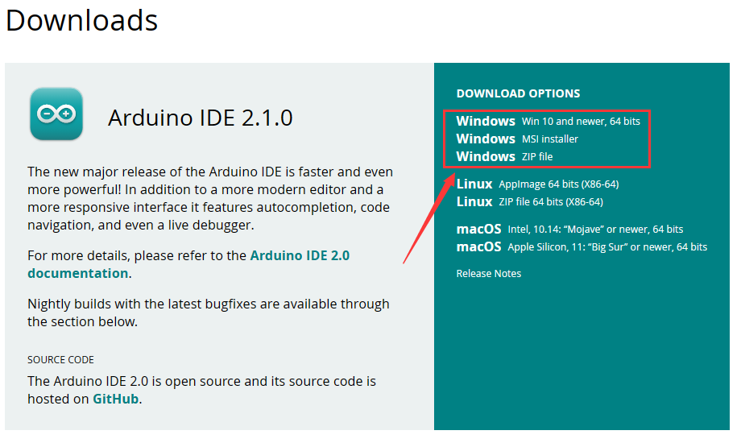

Here we will show you how to download and install the windows version of Arduino IDE. 

There are two versions of IDE for WINDOWS system. You can choose between the installer (.exe) and the Zip file.
 For installer, it can be directly downloaded, without the need of installing it manually while for Zip package,
  you will need to install the driver manually.


You just need to click **JUST DOWNLOAD**.

## **B. Mac System**

The versions of Arduino IDE vary from operation systems.

For how to download Arduino IDE on Mac, please refer to Windows:


After downloading, double-click to open it and follow the installation instructions.

## **C.Detailed installation steps：**

1.Save the .exe file downloaded from the software page to your hard drive and simply run the file .


2.Read the License Agreement and agree it.


3.Choose the installation options.

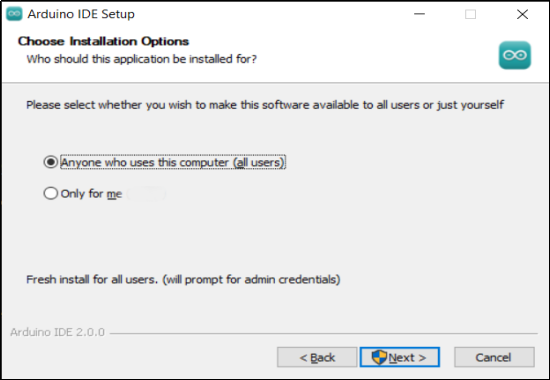

4.Choose the install location.


5.Click finish and run Arduino IDE


# **Install Board Driver**

## **Install CP2102 Driver on Windows System**

Download: [https://fs.keyestudio.com/CP2102-WINDOWS](https://fs.keyestudio.com/CP2102-WINDOWS)

Click the link to download , and we unzip it to 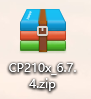. 

Unzip again and we will get the folder . Please remember the path of this folder for later use. 

 Right click Computer----- Properties----- Device Manager.  


The yellow exclamation mark on the page implies an unsuccessful  installation and you should double click , then click “**Update Drive...**”to update the driver. 


Click “**Browse my computer for drivers**” to find the downloaded Arduino software.


There is a DRIVERS folder in Arduino software installed package, please open this folder and check the driver of CP210X series chips.

Click “Browse...”, then search the driver of CP2102 and click“Next”.


After a while, the driver is installed successfully.

 

When opening the device manager, we will find that the yellow exclamation mark disappears, which means the driver of CP2102 is installed successfully.


## **Install CP2102 Driver on MAC System**

Connect board we provide to your computer, and open Arduino IDE.


Click "Tools" to select **Board: Arduino Uno** and **Port: /dev/cu.usbserial-0001**.


Tap  to upload code, if burn successfully, you will view Done uploading.


Note: If burn unsuccessfully, you need to install driver of CP2102, please continue to follow the instructions as below:

Download the driver of CP2102:[https://www.silabs.com/products/development-tools/software/usb-to-uart-bridge-vcp-drivers](https://www.silabs.com/products/development-tools/software/usb-to-uart-bridge-vcp-drivers)

1\. Select Mac OSX edition


2\. Unzip the downloaded package


3\. Open folder and double-click SiLabsUSBDriverDisk.dmg file.


4\. You will view the following files as follows:


5\. Double-click Install CP210x VCP Driver, tick Don’t warn me and tap Open.


6\. Tap Continue


7\. Tap Continue and Agree


8\. Click Continue and input your password


9\. Select Open Security Preferences


10\. Click the lock to unlock security & privacy preference.


11\. Then click Allow


12\. Back to installation page, and wait to install.


13\. Successfully installed


14\. Then enter ArduinoIDE, click Tools and select Board: Arduino Uno and /dev/cu.SLAB_USBtoUAPT


15\. Click to upload code and you will see “Done uploading”.


# **Arduino IDE Setting**

Click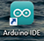icon to open Arduino IDE.


1. “File”: Including New Sketch, Open..., Sketchbook, Examples, Close, Save(Save as...), Preferences, Advanced..., etc.
2. “Edit”: Including Copy, Paste, Auto Format, Increase/Decrease Font Size, etc. Commonly, you can use shortcuts to do these operations.
3. “Sketch”: Including Verify/Compile, Upload, Include Library, etc.
4. “Tools”: Including Board and Port, which are two of the most important functions. 
5. “Help”: Including Check for Updates as well as some official data references. 
6. “Serial Plotter”: To display the data from serial port in the way of a line chart.
7. “Serial Monitor”: To prints the data from serial port. 
8. Verify code.
9. Verify and upload code.
10.  “Sketchbook”: To create a new sketch, or sign in to Arduino Cloud to sync and edit your Cloud Sketches.
11. “Boards Manager”: To install or remove development board. 
12. “Library Manager”: To install or remove library.
13. “Debug”: To monitor code and debug breakpoints.
14. Search.
15. Sketch editing area.
16. IDE Output: To report error or successful uploading, and to display data from serial monitor.

# **Upload Code To IDE**

## **Windows Arduino IDE Upload Code**

Upload code: An examples code is provided here: it will print “Hello Keyestudio!” per second.

Copy and paste the following code to Arduino IDE: 

```c
/*
  keyestudio 
  Print “Hello Keyestudio!”
  http://www.keyestudio.com
*/
void setup() {  
    // put your setup code here, to run once:
    Serial.begin(9600);  //Set the serial port baud rate to 9600
}

void loop() {  
    // put your main code here, to run repeatedly:
    Serial.println("Hello Keyestudio!");  //Serial port printing
 	delay(1000);  //Delay of 1 second
}
```


Click “Tools”——>“Board”——> Arduino AVR Boards, and here we choose Arduino Uno as our development board. 

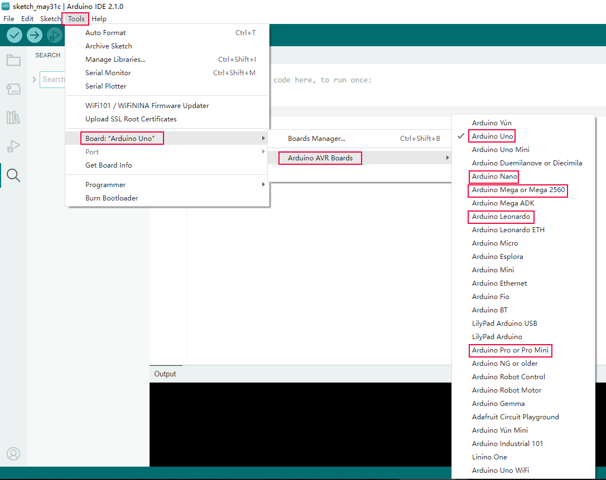

Choose the correct COM port.

If there are so many ports that you have no idea which is the correct one, you may unplug the board to check which one disappears. If there is no COM port, please check whether the driver is installed.


In our demostration, the port is COM3, so we click “Tools”to choose“COM3” in “Port”.


If your board is successfully connected, it will show on the interface. 

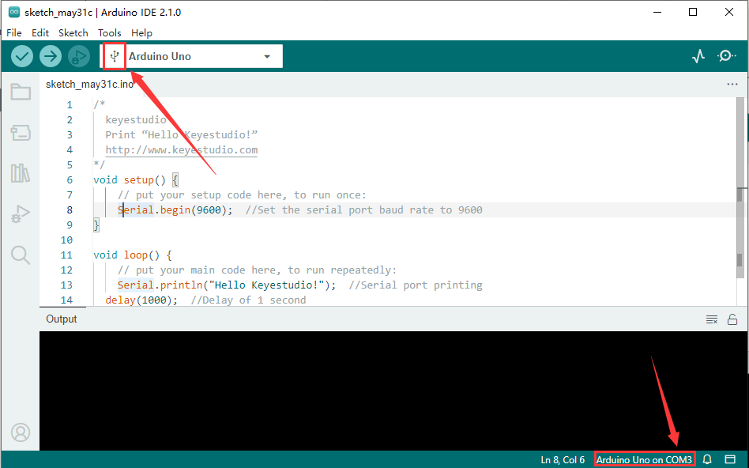

Click to compile the code. If it succeeds, the following two show up:


Click and set baud rate to 9600, and “Hello Keyestudio!” are being printed!

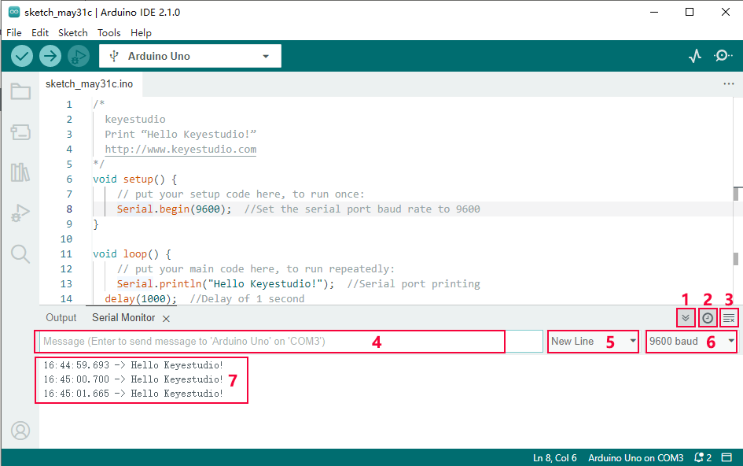

1. “Toggle Autoscroll”: To set whether to follow the print.
2. “Toggle Timestamp”: To set whether to display printing time.
3. “Clear Output”: To clear the output data.
4. Serial Input
5. Serial port sending format
6. Baud rate: To set the baud rate.
7. Printing box.

This is the end of how to upload code!

Now please import libraries for IDE, otherwise an error will occur. 

## **Mac Arduino IDE Upload Code**

Upload code: An examples code is provided here: it will print “Hello Keyestudio!” per second.

Copy and paste the following code to Arduino IDE: 

```c
/*
  keyestudio 
  Print “Hello Keyestudio!”
  http://www.keyestudio.com
*/
void setup() {  
    // put your setup code here, to run once:
    Serial.begin(9600);  //Set the serial port baud rate to 9600
}

void loop() {  
    // put your main code here, to run repeatedly:
    Serial.println("Hello Keyestudio!");  //Serial port printing
 	delay(1000);  //Delay of 1 second
}
```


Click “Tools”——>“Board”——> Arduino AVR Boards, and here we choose Arduino Uno as our development board. 


Choose the correct COM port.

If there are so many ports that you have no idea which is the correct one, you may unplug the board to check which one disappears. If there is no COM port, please check whether the driver is installed.

In “Tools”, click “Port” to select “/dev/cu.usbderial-0001”.

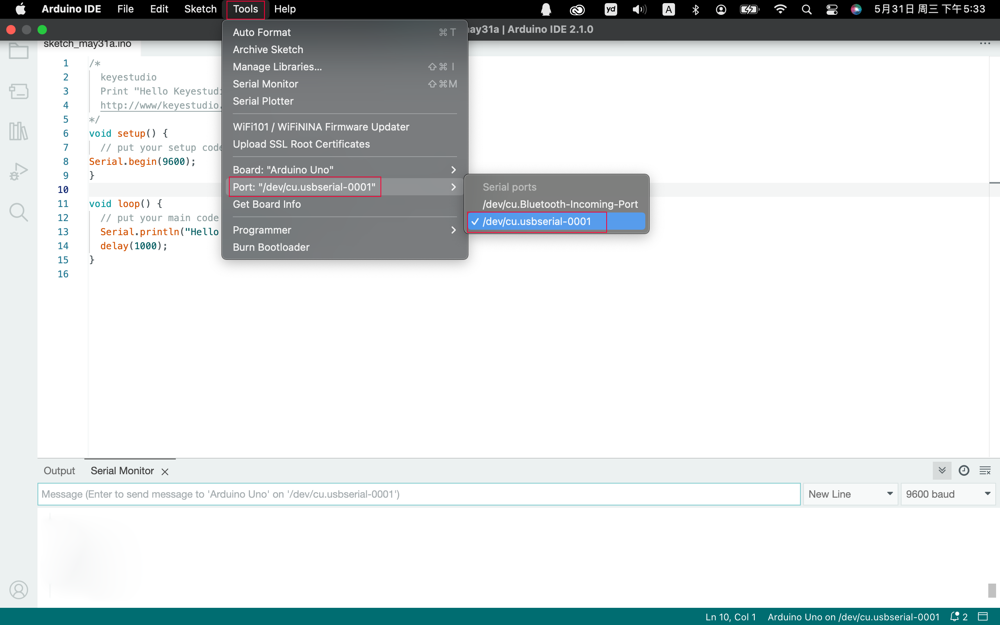

If your board is successfully connected, it will show on the interface. 


Click to compile the code. If it succeeds, the following two show up:

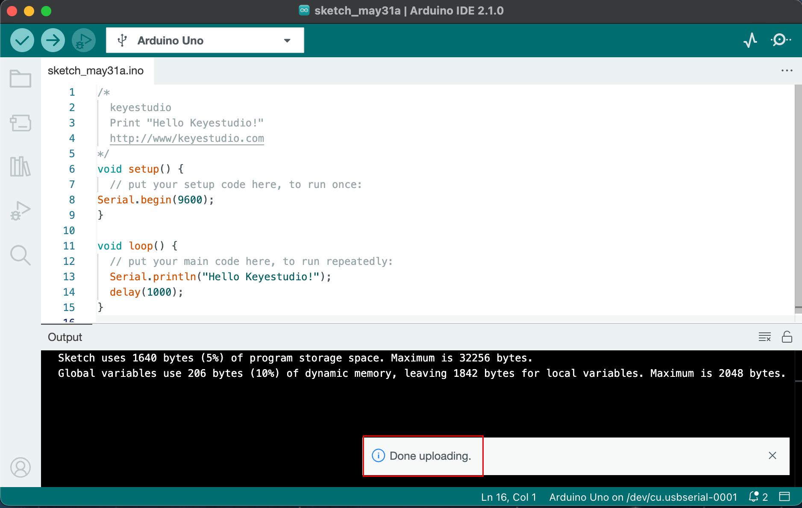

Click and set baud rate to 9600, and “Hello Keyestudio!” are being printed!


1. “Toggle Autoscroll”: To set whether to follow the print.
2. “Toggle Timestamp”: To set whether to display printing time.
3. “Clear Output”: To clear the output data.
4. Serial Input
5. Serial port sending format
6. Baud rate: To set the baud rate.
7. Printing box.

This is the end of how to upload code!

Now please import libraries for IDE, otherwise an error will occur. 


# **How To Import Library**

First of all, the corresponding Arduino library files are required. 

## **A. What are Libraries ?**

Libraries are a collection of code that make it easy for you to connect a sensor,display, module, etc.

For example, the built-in LiquidCrystal library helps talk to LCD displays. 

There are hundreds of additional libraries available on the Internet for download. The built-in libraries and some of these additional libraries are listed in the reference.

If there is an error 'No such file or directory' when compiling or uploading code, it means the library file is missing. As shown in the figure below, the error occurred when uploading LCD1602 module code due to the missing 'LiquidCrystal_I2C' library file.

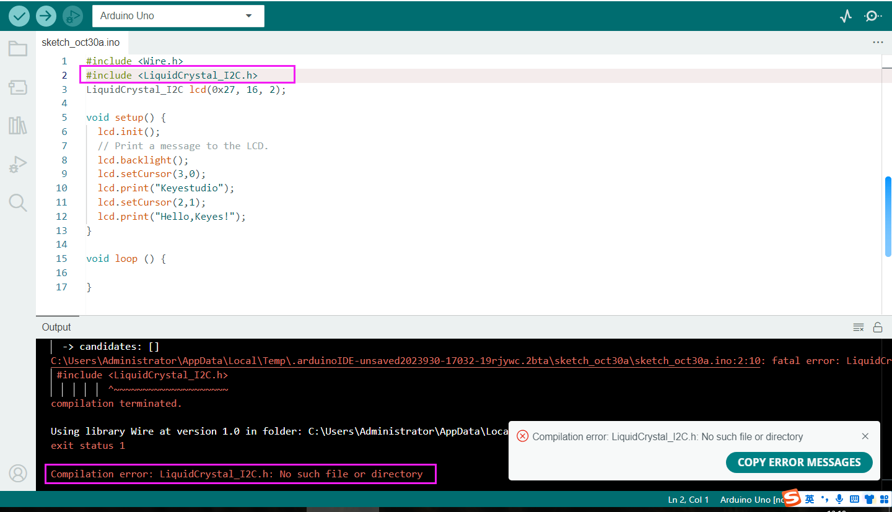

## **B. How to Install a Library ?**

<p style="color:red;">Let's take adding the "LiquidCrystal_I2C" library file as an example.<p>

Here we will introduce the most simple way to add libraries.

Click **Skerch > Include Library > Add .Zip Library...** in sequence. 


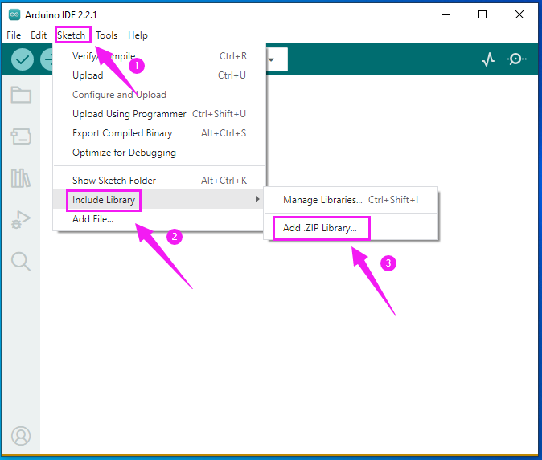

Find files(.zip) you need to add as library and wait. “**Library installed**” will be displayed if library is successfully added.


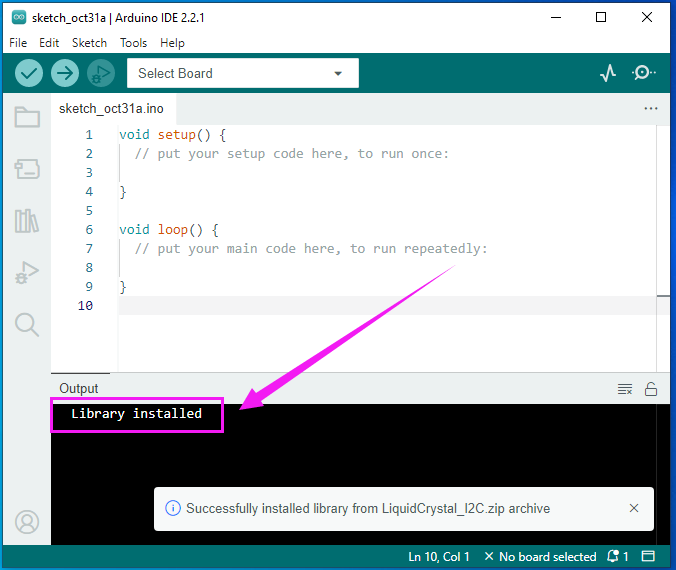

**Dynamic operation example:**


For how to include a library, the method of the two system is the same. 

For more details, please visit our official website: [https://www.keyestudio.com/](https://www.keyestudio.com/)


